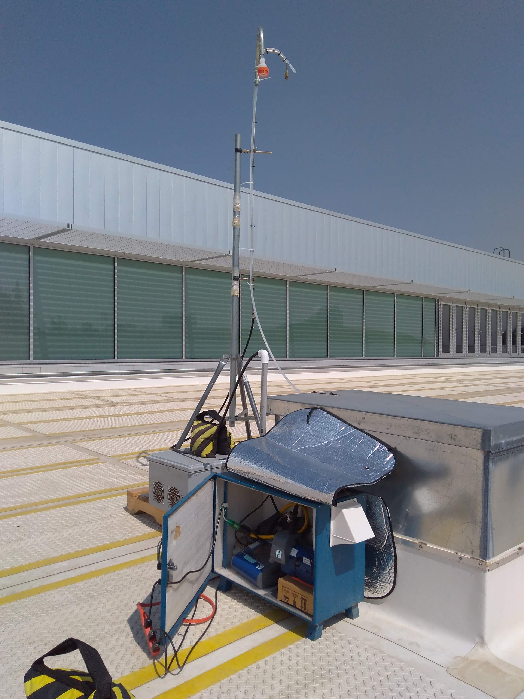
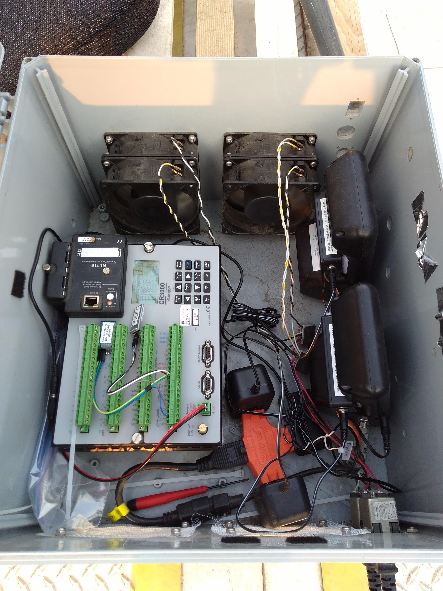
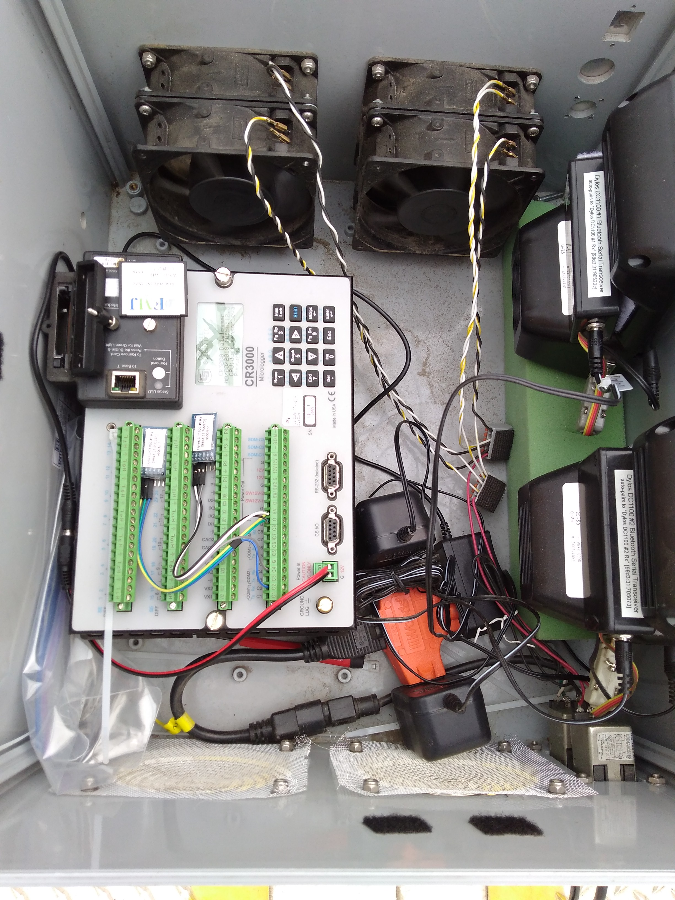

# 2018 Data Set Logbook

## Wildfire Smoke Events in Pullman, WA

Event record for 2018 wildfire data set collection in the WSU Paccar 
Environmental Technology Building.

### 2018-08-17

Setup DustTrak II units inside of blue ventilated enclosure. Yibo and Anna
configured both units with PM2.5 inlets and placed enclosure on rooftop for
co-located sampling with Indoor Air & Climate Change Study equipment (PETB 415).

In the evening, placed both Dylos DC1100 units in ventilated enclosure at the
foot of IA&CC sampling equipment inlet

### 2018-08-20

~11:40 PDT  
Halted data collection to retrieve data sets:
  * DustTrak #1 ("outdoor"): `8530150710/IAQ_OUTDOOR_026.csv`
  * DustTrak #2 ("indoor"): `8530152108/IAQ_INDOOR_012.csv`
  * Logger for Dylos units: `roof_logger/TOA5_lab-cr3000.dylos_20180817.dat`
    * Found DC1100 #1 turned off &rarr; turned both units off, then back on
      simultaneously
    * Placed foam block under units to sandwich against lid and prevent from
      turning off again

Re-synced clocks and began data recording again (PST/Z-0800):
  * DustTrak #1 ("outdoor"): 10:47:37 (@ 10:48:05) &rarr; 10:48:56 (@ 10:49:09)
    * *Little slow taking photo; is synced better than 10sec*
  * DustTrak #2 ("indoor"): 10:45:21 (@ 10:48:13) &rarr; 10:49:20 (@ 10:49:24)
    * *For data reduction, shift old files 1 record (2min) into future*
  * Logger for Dylos units: 10:52:27 (@ 10:49:39) &rarr; 10:50:10 (@ 10:50:18)
    * *For data reduction, shift old files 2 records (2min) into past*
    * *Unit #1 got shut off immediately after closing up enclosure.. delete
      duplicated data values (virtually all data)*

> See images in [img/](img/) for clock statuses.

### 2018-08-23

10:00 PDT  
Halted data collection and retrieved data sets:
  * DustTrak #1 ("outdoor"): `8530150710/IAQ_OUTDOOR_027.csv`
  * DustTrak #2 ("indoor"): `8530152108/IAQ_INDOOR_013.csv`
  * Logger for Dylos units: `roof_logger/TOA5_lab-cr3000.dylos_20180820.dat`
    * *Data sets still contain duplicated values when comms is interrupted -
      check for and delete values if both channel values remain the same.*

Reduced data set collected Aug 17-Aug 20.. see notes above.

